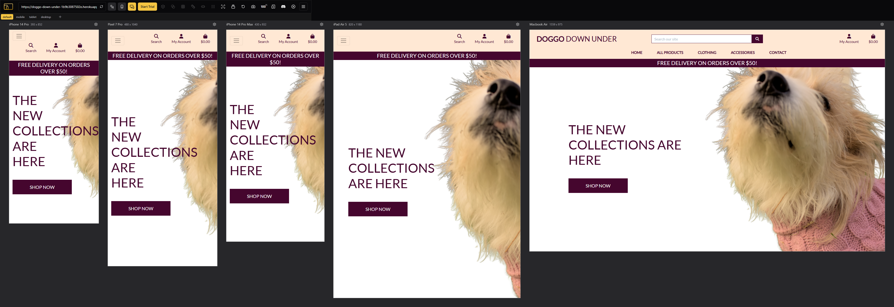

# Doggo Down Under

Doggo Down under is a website selling dog products in Australia. It allows users to purchase a wide range of dog products. Users can search for products via name, category and product description, users can filter based on price and rating. User experience and mobile development is at the heart of Doggo Down Under and users who want to purchase dog products will have a great experience using this website.

The live site is available here: [Doggo Down Under](https://doggo-down-under-1b9b3087502e.herokuapp.com/).

## Table of Contents
- [SEO and Marketing](#seo-and-marketing)
- [Business Model](#business-model)
- [Features](#features)
- [Agile Methodology](#agile-methodology)
- [Design](#design)
- [Technologies Used](#technologies-used)
- [Testing](#testing)
- [Deployment](#deployment)
- [Bugs](#bugs)
- [Credits](#credits)

## SEO and Marketing

A link to a popular dog charity was added in the footer to increase SEO for the website. 

### SEO, Keywords

The final keywords used on the website were dog, pet, store, online, shop, toys, food, accessories.

### Marketing
Based on Code Institute's Web Marketing, questions were collected to try to decide on marketing for the website.

- What kind of business is it?
  - B2C
- Who are your customers?
  - Customers looking for quality dog products in Australia
- Which online platforms would you find lots of your users?
  - Facebook
- What do your users need? How could you deliver useful content to them?
  - Dog products. Content could be delivered in cute dog vidoes
- Would your business run sales or offer discounts? How do you think your users would most like to hear about these offers?
  - Sales and discounts could be offered. Either through posting alerts for sales on social media or sending discount codes to people on the newsletter.
- Would your business have a budget to spend on advertising? Or would it need to work with free or low cost options to market itself?
  - Possibly a small budget. Perhaps it would start with low cost options like social media and newsletters.

The e-commerce businesses that inspired aspects of this website include:
  - [Petworld](https://www.petworld.ie/)
  - [Petstop](https://www.petstop.ie/)

### Social Media

Facebook Mockup

A Facebook business page was created for the website. Above is the screenshot of the page. This would be the primary social media site for the business to communicate with customers. Link to [Facebook page here](https://www.facebook.com/profile.php?id=61572882855702)

### Email

Through a subscription form in the footer, the website saves email addresses and allows the website owner to collect email addresses to send out a newsletter. The intention with the newsletter would be to update customers when new products are added to the site, or to send discount codes to newsletter subscribers which is a common practice.

## Business Model
Doggo Down Under is a Business-to-Customer (B2C) e-commerce platform specializing in dog products. The website provides an online storefront where customers can browse, purchase, and receive high-quality dog-related products delivered to their doorsteps. The platform caters to both new and returning customers, ensuring a seamless shopping experience with features such as a wishlist, shopping cart, secure checkout, and account management.

### Revenue Model
Doggo Down Under primarily generates revenue through direct product sales, with potential for expansion into additional revenue streams:

1. Retail Sales:

- A curated selection of dog products, including toys, accessories, grooming supplies, food, and treats.
- Customers can add products to their shopping bag and complete purchases via Stripe-powered secure payments.

2. Upselling & Cross-Selling:
- Product recommendations on product pages to encourage additional purchases.
- Special bundle offers or discounts for purchasing related items together.

3. Loyalty & Repeat Business:
- Wishlist feature allows customers to save favorite products for future purchases.
- Email marketing via newsletter subscription, keeping customers engaged with promotions and new product releases.

### Customer Segments
Doggo Down Under primarily targets:
- Dog Owners: Individuals looking for high-quality products for their pets.
- New Pet Owners: First-time dog owners needing essential supplies.
- Gift Buyers: People purchasing gifts for dog-loving friends and family.
- Repeat Customers: Returning shoppers who benefit from promotions and loyalty incentives.

### Key Features Supporting the Business Model
- User-Friendly Navigation & Search Bar: Ensures customers can quickly find the products they need.
- Secure Checkout with Stripe Integration: Provides a seamless and trustworthy payment experience.
- Mobile & Desktop Optimization: Ensures a responsive shopping experience across all devices.
- Newsletter Signup: Enables direct communication with customers for promotions and updates.
- Social Media Links: Increases brand visibility and customer engagement via Facebook.

## Features
### General

This section discusses the more generic features available throughout the site for all users of the website.

#### Navigation Bar

Navigation Bar

The navigation bar is featured across all pages. The navbar is a slightly modified version of the first example from [Bootstrap's navbar documentation](https://getbootstrap.com/docs/5.2/components/navbar/). It includes drop down menus for "All Products", "Clothing" and "Accessories", a drop down menu for logging in/registering or for accessing logged in user functionality like "My Profile", "Product Management" and "My Wishlist", a link to "Home" and a cart icon. It also features the website's logo and a search bar.

The logo in the navbar is visible on all larger screens and links to the home page as user's expect so that it is quick and easy to return to the index from any page on the site.

The search bar is featured in the navbar to make it accessible from any page on the site so that a user can quickly search for a product whenever they want, however it is only immediately visible on larger screens. On smaller screens it is available in the collapsible menu through the navbar toggle to reduce clutter on the screen.

#### Footer

Footer

The footer is featured across all pages on the website. It includes two simple sections related to customer communication, offering ways for the customer to communicate with the business.

The first section includes the newsletter subscription form. It's a very simple form that only requests the user's email address to sign up.

The third section features social media links for the user to find the business on Facebook.

It also includes a link to a popular dog charity in AUstralia for further reading for users

#### Index Page

Index Page

The index or home page appears the same for all users. It features a hero image of a cute dog with a jumper on, visible to the user immediately upon landing on home page. The carousel currently includes three images. There is a call to action on the hero image to entice the user to browse the shop collection.

Overall, the index page is intended to be engaging, informative without overwhelming the customer, and to encourage the user to explore the website further.

### Products

This section discusses the features related to the products app. 

#### Search Products

Search Products

The search form in the navbar has basic search functionality. It searches for matches in the product names and description and returns the results displayed as product cards. At the top of the page it informs the user of the number of products found that match the query and includes the query in the result so the user can be sure of what they searched.

#### Categories

Categories

The category pages are featured on the "Shop" drop down menu on the navbar. There is a link for each category - Sweaters, Raincoats, Bowls, Toiletries, Kits, Food, Toys. There is a link for all clothing and all accessories too

There is a single, simple category template that is used for every category page so that all of these pages have the same layout and are easy to understand for the user. The layout is very simple, the products are displayed in "Product Cards".

There is a simple filter functionality on the category pages which filters the page by subcategory. Almost all products fall within one of "Mild", "Medium", "Hot", and "Mega Hot" subcategories which the user can filter by selecting the subcategory from the drop down menu and clicking "Go".

#### Product Detail Page

Product Page

The product detail page has two main sections, the second of which is the product reviews and is discussed in more detail later on in the "Reviews" features.

The first section on this page features all of the products details. The template used for this page is used for all products so that all product detail pages have a similar layout. Similarly, one product model is used for all products with the choice of fields used depending on the type of product.

A pcture of the product is displayed along with the product, name, price, category, rating, description, quantity selectyor, option to add to bag, option to keep shopping, option to add to wishlist, and a reviews section. The review form is only avalible to users who have previously purchased the product. Any reviews already written can be read at the bottom of this page.

### Shopping bag

This section discusses the features associated with the bag app and the functionality involved with managing the user's shopping bag.

Shopping bag

The shopping bag allows the user to add products from the products pages into the shopping bag. Once in the bag the user can then proceed to checkout from there and purchase the products. The bag features a product image, name, SKU, price, quanity selector and the subtotal of all the items in the bag. The delivery cost is also displayed. There are two buttons to allow the user to continue shopping or to checkout. Products can be removed from the bag as well as increasing or decreasing the number in the bag.

### Purchasing

This section discusses the features related to the checkout app and the functionality involved with user purchases on the site.

#### Checkout

Checkout

To reach the checkout page, the user can click on the link in the cart offcanvas element or on the "Checkout" button below the summary table on the cart page.

The checkout page has two sections. To the right or on top, depending on the size of the user's device, is the summary of the order. Similarly to the cart page, this summary is a simple table listing the most relevant details of the items in the order. It includes small thumbnails of the items as well as the name just to be clear to the user what they are purchasing. Below this is the delivery cost and grand total.

On the left of or below the order summary, is the form for delivery details. It appears slightly differently depending on whether the user is logged in or not, and whether their details are already saved. For a guest user the form will appear blank. If the user is logged in but has not saved their details previously, the email field will be prepopulated and at the bottom of the form is an option to save their details to their profile.

Directly below the delivery details is the [Stripe](https://stripe.com) card element where the user inputs their card details to complete the order. Before the submit button, there is a warning to the user stating how much money their card is about to be charged.

For the delivery form and Stripe elements, the code is based on Code Institute's [Boutique Ado](https://github.com/Code-Institute-Solutions/boutique_ado_v1) project.

### User Authentication and Profiles

This section discusses features related to the user authentication, and user profiles.

#### Registration

Register

[Django allauth](https://django-allauth.readthedocs.io/en/latest/index.html) was used for user authentication for this website and so functionality for registration and authentication is handled by allauth. The templates used for registration, login/logout, and email confirmation are allauth templates which have been styled to match the rest of the website.

Registration is accessed through the "Register" link under the "Account" drop down menu and is unnecessary for most functionality on the website. A user can complete a purchase and generate a successful order without registering.

The login page is accessed through a "Login" link under the "Account" drop down menu and the template is standard from allauth and accepts either the user's username or email and their password as valid credentials to login. 

When a user is logged in, the log out page is accessed through a "Logout" link under the "Account" drop down menu. Again, this is a standard allauth template styled to match the rest of the website.

#### User Profile

User Profile

User profiles are created automatically when a user registers with the website, as based off of the code from Code Institute's [Boutique Ado](https://github.com/Code-Institute-Solutions/boutique_ado_v1) project. When a user logs in, they are redirected to their profile.

The main page of the user profile includes a section for the user's details and a table of their order history. Above the user's details, there are options available for the user to edit their profile details and to delete their account.

The order history table summarises their orders with their order number, the date it was placed, the total and a link to the checkout success page for that order so that they can review it in more detail there.

#### Product Reviews

Product Reviews

Once a user has purchased a product and it is in their order history they are able to see a review form on the product detail page. They can write a text review and submit it. Once a user has left a review they cannot leave another review. All website users can read any review on the product detail page. 

### Management

Superusers can access a product management feature through the nav bar. This allows super users to add new products including images without having to use the admin panel. Super users can also edit and delete current products from the product card. 

#### Products

Management Products

### Admin

Most of the functionality available on the main website to staff users is also available through the admin panel. Most models are registered to allow admin users to perform CRUD functionality through the admin panel.

### Future Features

1. __Order Again__:
  - For registered users you could offer an "Order Again" button for items in their order history. This could be as simple as clicking the button and adding the item to their cart like on a product page, with the function only having to check whether it is in stock or not.
2. __Improved Category Filtering__: 
  - Expanding category filtering beyond subcategory could include filtering by average user rating or popularity, if we were to expand the product model to track the number sold.
3. __Dog Care Blog__:
  - As part of marketing and providing content to users, a dog care blog may could expand the site further beyond products, giving users another reason to return to the site between purchases.
4. __Expanded Product Range__:
  - Providing products beyond dog items. Expanding the range to include items related to other animals could draw more users, and repeat users. This may require altering the current product models. 

## Agile Methodology
### User Stories

#### **1. Homepage Access**  
**User Story**:  
*As a new customer, I want to view a welcoming homepage with a hero image so I can quickly understand the website’s purpose and quickly get to explore items.*  

**Acceptance Criteria**:  
1. Hero image displays prominently at the top of the page.   
2. Footer includes links to social media icons.  

**Tasks**:  
- Design hero image section with a "Shop Now" CTA button.   
- Add footer with company links and social icons.  
- Test cross-browser compatibility.  

---

#### **2. Product Search**  
**User Story**:  
*As a customer, I want to search for products using keywords so I can find specific items quickly.*  

**Acceptance Criteria**:  
1. Search bar returns relevant results (e.g., "dog bed" shows beds).  
2. No-results message appears if no matches exist.  
3. Search works on both desktop and mobile.  

**Tasks**:  
- Integrate search functionality into the navbar.  
- Develop backend API for product search.  
- Create a "No results found" UI state.  
- Test search speed and accuracy.  

---

#### **3. Product Filtering**  
**User Story**:  
*As a budget-conscious customer, I want to filter products by price and category to narrow down options.*  

**Acceptance Criteria**:  
1. Filters update product grid dynamically.  
2. Clear/reset filters button is available.  

**Tasks**:  
- Add filter sidebar/dropdown (desktop/mobile).  
- Implement backend logic for filtering.  

---

#### **4. Wishlist Management**  
**User Story**:  
*As a returning customer, I want to save items to a wishlist.*  

**Acceptance Criteria**:  
1. "Add to Wishlist" button appears on product cards/detail pages.  
2. Wishlist page displays saved items. 
3. Items persist after logout (if user is logged in).  

**Tasks**:  
- Create wishlist database model.  
- Add wishlist UI buttons and endpoints.  
- Design wishlist page with item thumbnails.  
- Test guest vs. logged-in user behavior.  

---

#### **5. Shopping Bag Updates**  
**User Story**:  
*As a customer, I want to adjust quantities or remove items from my bag to correct mistakes.*  

**Acceptance Criteria**:  
1. Quantity selector updates subtotal in real time.  
2. "Remove" button deletes items instantly.  
3. Bag total recalculates automatically.  

**Tasks**:  
- Implement quantity +/- buttons.  
- Add "Remove" functionality with confirmation.  
- Develop dynamic total calculation logic.  
- Test edge cases (e.g., zero quantity).  

---

#### **6. Guest Checkout**  
**User Story**:  
*As a first-time buyer, I want to checkout without creating an account to save time.*  

**Acceptance Criteria**:  
1. "Checkout as Guest" option is visible.  
2. No forced account creation during checkout.   

**Tasks**:  
- Design guest checkout flow.  
- Implement session-based bag storage.  
- Test checkout process end-to-end.  

---

#### **7. Secure Payment**  
**User Story**:  
*As a security-conscious customer, I want to enter payment details securely to protect my data.*  

**Acceptance Criteria**:  
1. Checkout page uses HTTPS.  
2. Payment fields are encrypted (e.g., Stripe integration).  
3. No payment data is stored locally.  

**Tasks**:  
- Set up stripe account and ensure integration

---

#### **8. Mobile Responsiveness**  
**User Story**:  
*As a mobile user, I want the site to adapt to my screen size for easy shopping.*  

**Acceptance Criteria**:  
1. Hamburger menu collapses navbar links on mobile.  
2. Product grids switch to single-column layout.  
3. Buttons and text are tap-friendly.  

**Tasks**:  
- Optimize images for mobile load speeds.  
- Test on iOS/Android devices.  
- Fix overflow/alignment issues.  

---

#### **9. Newsletter Subscription**  
**User Story**:  
*As a loyal customer, I want to subscribe to newsletters for updates and discounts.*  

**Acceptance Criteria**:  
1. Email input field exists in the footer.  
2. Success toast appears after subscription.   

**Tasks**:  
- Add newsletter form to footer.  
- Design model to save emails to database

---

## Design

### Colour

The colour palette used for the website based on the classic look of other ecommerce stores like Amazon. Black and white are the primary colours and afford good contrast. The hero picture is a striking yellow background which provides great contrast against the rest of the site. The site is simple and elegant in colour design.

### Mockups

I had previously created a website with the idea of dropshipping dog colthes. The website was created through wordpress and some of the original feautures of that website are present in this site such as the favicons.

### Wireframes

Wireframes were created in ascii style.

Index

+-----------------------------------------------------------------------+
| 🐾 Doggo Down Under          Home | Products | Wishlist | Bag 🛒 🔍   |
+-----------------------------------------------------------------------+
|                               HERO IMAGE                              |
|                     "Premium Aussie Dog Products!"                    |
|                            [SHOP NOW BUTTON]                          |
+-----------------------------------------------------------------------+
| [Product Card 1]    [Product Card 2]    [Product Card 3]    [Product 4]  
|   Image               Image               Image               Image     
|   Name ($20)          Name ($30)          Name ($25)          Name ($40) 
+-----------------------------------------------------------------------+
| About Us | Contact | Privacy Policy | 📧 Newsletter: [Email] [Sign Up] |
| [FB] [IG] [TikTok]                                                    |
+-----------------------------------------------------------------------+

+-----------------------------+
| [☰] Doggo 🐾 [🔍]           |
+-----------------------------+
|         HERO IMAGE          |
| "Shop Aussie Dog Gear!"     |
|      [SHOP NOW BUTTON]      |
+-----------------------------+
| [Product Card 1]            |
| Image + Name + Price        |
| [Product Card 2]            |
| ... (Single Column)         |
+-----------------------------+
| About Us | Contact          |
| [FB] [IG] [TikTok]          |
| Newsletter: [Email] [Sign Up]
+-----------------------------+

Wishlist

+-----------------------------------------------------------------------+
| 🐾 Doggo Down Under          Home | Products | Wishlist ❤️ | Bag 🛒 🔍|
+-----------------------------------------------------------------------+
| WISHLIST ITEMS:                                                      |
| [Thumbnail] Chew Toy       | $15       | [Move to Bag] [🗑️ Remove]   |
| [Thumbnail] Dog Bed        | $50       | [Move to Bag] [🗑️ Remove]   |
+-----------------------------------------------------------------------+
| About Us | Contact | Privacy Policy | [Social Icons]                 |
+-----------------------------------------------------------------------+

+-----------------------------+
| [☰] Doggo 🐾 ❤️ [🔍]        |
+-----------------------------+
| Chew Toy | $15 [Move to Bag]|
| Dog Bed  | $50 [Move to Bag]|
+-----------------------------+
| About Us | Contact          |
+-----------------------------+

Products

+-----------------------------------------------------------------------+
| 🐾 Doggo Down Under          Home | Products | Wishlist | Bag 🛒 🔍   |
+-----------------------------------------------------------------------+
| Filters: Categories ▼ | Price ▼ | Sort: Relevance ▼                   |
+-----------------------------------------------------------------------+
| [Product Card] [Product Card] [Product Card] [Product Card] ...       |
| Image + Name + Price + [Add to Bag]                                   |
| ... (Repeat grid)                                                     |
+-----------------------------------------------------------------------+
| About Us | Contact | Privacy Policy | [Social Icons]                  |
+-----------------------------------------------------------------------+

+-----------------------------+
| [☰] Doggo 🐾 [🔍]           |
+-----------------------------+
| Filters: [Dropdown Menu]    |
+-----------------------------+
| [Product Card 1]            |
| Image + Name + Price        |
| [Product Card 2]            |
| ... (Single Column)         |
+-----------------------------+
| About Us | Contact          |
+-----------------------------+

Product Detail

+-----------------------------------------------------------------------+
| 🐾 Doggo Down Under          Home | Products | Wishlist | Bag 🛒 🔍   |
+-----------------------------------------------------------------------+
| [Large Product Image]          Product Name: Chew Toy                 |
|                                 Price: $15                            |
|                                 Size: [Dropdown]                      |
|                                 Color: [Dropdown]                     |
|                                 [Add to Bag] [❤️ Wishlist]            |
|                                 Description: Durable rubber...        |
+-----------------------------------------------------------------------+
| About Us | Contact | Privacy Policy | [Social Icons]                  |
+-----------------------------------------------------------------------+

+-----------------------------+
| [☰] Doggo 🐾 [🔍]           |
+-----------------------------+
| [Product Image]             |
| Name: Chew Toy ($15)        |
| Size: [Dropdown]            |
| [Add to Bag] [❤️]           |
| Description: Durable...     |
+-----------------------------+
| About Us | Contact          |
+-----------------------------+

Shopping bag

+-----------------------------------------------------------------------+
| 🐾 Doggo Down Under          Home | Products | Wishlist | Bag 🛒 🔍   |
+-----------------------------------------------------------------------+
| ITEMS IN BAG:                                                        |
| [Thumbnail] Chew Toy       | Qty: [2] | $30       | [🗑️ Remove]      |
| [Thumbnail] Dog Bed        | Qty: [1] | $50       | [🗑️ Remove]      |
+-----------------------------------------------------------------------+
| ORDER SUMMARY:                                                       |
| Subtotal: $80                                                        |
| Shipping: $10                                                        |
| Total: $90                                                           |
| [Checkout Button]                                                    |
+-----------------------------------------------------------------------+
| About Us | Contact | Privacy Policy | [Social Icons]                  |
+-----------------------------------------------------------------------+

+-----------------------------+
| [☰] Doggo 🐾 [🔍]           |
+-----------------------------+
| Chew Toy x2 | $30 [🗑️]     |
| Dog Bed x1  | $50 [🗑️]     |
+-----------------------------+
| Subtotal: $80              |
| Shipping: $10              |
| Total: $90                 |
| [Checkout Button]          |
+-----------------------------+

Checkout

+-----------------------------------------------------------------------+
| 🐾 Doggo Down Under          Home | Products | Wishlist | Bag 🛒 🔍   |
+-----------------------------------------------------------------------+
| SHIPPING ADDRESS:                                                    |
| Full Name: [__________]                                              |
| Address: [__________]                                                |
| City: [__________]                                                   |
| Payment: [Card Number] [Expiry] [CVC]                                |
+-----------------------------------------------------------------------+
| ORDER SUMMARY:                                                       |
| Chew Toy x2: $30                                                     |
| Dog Bed x1: $50                                                      |
| Subtotal: $80 | Shipping: $10 | Total: $90                           |
| [Place Order Button]                                                 |
+-----------------------------------------------------------------------+

+-----------------------------+
| [☰] Doggo 🐾 [🔍]           |
+-----------------------------+
| Full Name: [__________]     |
| Address: [__________]       |
| Card: [__________]          |
+-----------------------------+
| Items: $80 | Total: $90     |
| [Place Order]               |
+-----------------------------+

### Entity Relationship Diagrams

ERD

## Technologies Used

- [HTML](https://en.wikipedia.org/wiki/HTML5)
- [CSS](https://en.wikipedia.org/wiki/CSS)
- [JavaScript](https://www.javascript.com/)
- [Python](https://www.python.org/)
- [Django](https://www.djangoproject.com/)
  - [Django allauth](https://django-allauth.readthedocs.io/en/latest/index.html)
  - [Django Crispy Forms](https://pypi.org/project/django-crispy-forms/)
  - [Django countries](https://pypi.org/project/django-countries/)
  - [Crispy Bootstrap5](https://pypi.org/project/crispy-bootstrap5/)
- [Stripe](https://stripe.com)
- [JQuery](https://jquery.com/)
- [HTMX](https://htmx.org/)
- [Bootstrap](https://getbootstrap.com/)
- [Cloudinary](https://cloudinary.com/)
- [GIT](https://git-scm.com/)
- [GitHub](https://github.com/)
- [VSCode](https://code.visualstudio.com/)
- [Heroku](https://)
- [Google Fonts](https://fonts.google.com/)
- [Font Awesome](https://fontawesome.com/)
- [Balsamiq](https://balsamiq.com/)
- [Diagrams.net](https://www.diagrams.net/)
- [GIMP](https://www.gimp.org/)

## Testing

Testing for the site can be found at the below link:
[Link to TESTING.md](TESTING.md)

## Deployment

Detailed deployment steps can be found at the below link:
[Link to DEPLOYMENT.md](DEPLOYMENT.md)

### Steps to clone site:
- In the GitHub repository, click the "Code" button.
- Select "HTTPS" and copy the URL.
- Open Git Bash and navigate to the repository where you would like to locate the cloned repository.
- Type "git clone" followed by the copied URL.
- Press enter to create the clone.
- Install required packages with the command "pip3 install -r requirements.txt"

## Bugs
### Console error
There is an error in the console when a product is in the shopping bag. The error indicates that this is due to Stripe.

### Future Improvements
- Add the ability to edit full name and username in the my profile form
- Integrate the ratings functionality with the review feature
- Add sizes to all products that can be sold in sizes and to add a stock counting feature
- Add CRUD functionality for reviews. As of now reviews cannot be edited or deleted
- Add defensive programming to ask users if they are sure threy want to delete or edit 

## Credits
### Code
- The code for the website was heavily based on the code for Boutique Ado by [Code Institute](https://codeinstitute.net/ie/). All credit goes to code institute and the lecturer who gave the pp5 module for the majority of the code base has came from there.

### Media
- Favicons created with [Favicon Generator](https://favicon.io/)
- Icons are from [Font Awesome](https://fontawesome.com)
- The fonts are imported from [Google Fonts](https://fonts.google.com)
- Product images from the internet and from photos I took myslef

### Acknowledgement
- Iuliia Konovalova - My mentor Julia was very supportive during this project. She certainly pushed me to complete a high standard of project especially for the readme and testing sections. I took inspiration from her README.md and TESTING.md files for my own.
- Happiness Generator - My first hackathon project. I learned so much from participating in this project and team. We won the March hackathon for 2024 and my team members were a great source of inspiration for me.
- freeCodeCamp - I completed the freeCodeCamp responsive web design module before enrolling in code institute and I learned much from that module that I was able to utilise for this project.
- CodeInstitute - The learning material produced by code institute has been very high quality and I have learned a lot from it. 
Boutique Ado - The Boutique Ado app has heavily influnced this project. As it was only the second django project I had seen before and with the complexity of producing a django project for the second time I had to heavily lean on the existing project. A lot of the Doggo Down Under website is taken from the boutique Ado project but I have made enough changes to it to create a unique standalone project.